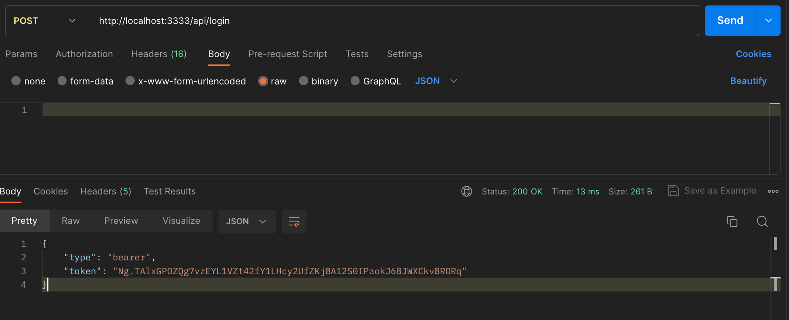
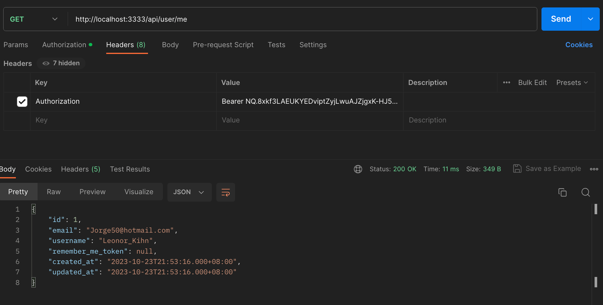

# Adonisjs startup

Adonisjs 框架

## Start

依赖

- nodejs 版本：v20
- 包管理器：pnpm


项目启动
```bash
# 安装依赖
pnpm install

# 项目启动
pnpm dev
```

数据表迁移和填充
```bash
# 生成数据库，并迁移数据表结构（生成的数据库文件在 tmp/db.sqlite3
node ace migration:run

# 数据填充
node ace db:seed
```

## 常见通用接口

以下列出项目中常见的通用接口，可基于上面修改

| 接口             | Method | URL            | 说明                                        |
| ---------------- | ------ | -------------- | ------------------------------------------- |
| 登录             | `POST` | `/api/login`   | 登录后获取 Token                            |
| 当前登录用户信息 | `GET`  | `/api/user/me` | 请求头需包含  `Authorization: Bearer TOKEN` |

登录


获取信息

